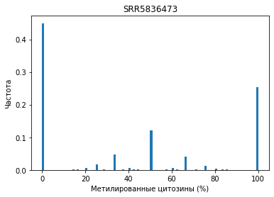
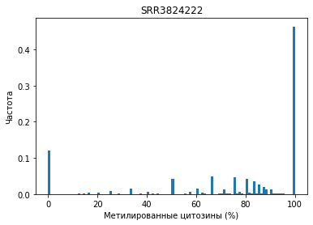

# hse_hw1_meth
Колаб:
https://colab.research.google.com/drive/19LtK0-um4z5LdB2vpHBUJKdVkDm01aGh?usp=sharing

 **Какие особенности можно наблюдать по сравнению с секвенированием ДНК или РНК?**: Количество нуклеотидов GC преобладает в сравнении с остальными нуклеотидами.
 
 
### Закартированные риды
Образец\регион | 11347700-11367700 | 40185800-40195800 | 
--- | --- | --- |
cell8 | 1090 | 464 | 
epiblast | 2328 | 1062 | 
icm | 1456 | 630 | 

### Дедупликации
Образец | Кол-во дедупликаций | Кол-во дупликаций
--- | --- | --- |
SRR5836473 | 2328327 (81.69% of total) | 521904 (18.31%)
SRR5836475 | 3782116 (90.92% of total) | 377882 (9.08%)
SRR3824222 | 6833758 (97.08% of total) | 205258 (2.92%)

bash-скрипт:
```
!ls *pe.bam | xargs -P 4 -tI{} deduplicate_bismark  --bam  --paired  -o s_{} {}
```
### Распределения метилирования цитозинов




### Уровни метелирования и покрытия
***Метилирование:***

***Покрытие:***


